## 시스템 설계

### ⌚ **Apple Watch Ultra 2 (검정색)**
**역할**: 실시간 센싱 & 오프라인 로깅
- **Sensor APIs**: 압력계, 심박수, 수온 센서로 0.5초 주기 데이터 수집
- **Core Modules**: 세션 자동 관리, 실시간 모니터링, 안전 알림, 회복 타이머
- **Data Layer**: 오프라인 로컬 저장 → 동기화 큐 관리

### 📱 **iPhone (파란색)**
**역할**: 데이터 분석 & 시각화 & 커뮤니티
- **Sync Manager**: Watch로부터 데이터 수신 → 로컬 저장 → iCloud 백업
- **Analytics Engine**: 세션 통계, PB 추적, 트렌드 분석
- **Visualization**: 수심-시간 그래프, 차트 생성
- **Community Manager**: 버디, 다이브 스팟, 챌린지 관리

### ☁️ **Backend (녹색)**
**역할**: 중앙 데이터 관리 & AI 분석
- **API Gateway**: 인증/인가, 라우팅, Rate Limiting
- **Microservices**: User, Dive, Social, Challenge 서비스 분리
- **AI/ML Pipeline**: 훈련 추천, 인사이트 분석
- **Data Storage**: PostgreSQL(주 DB), Redis(캐시), S3(미디어)

## 🔄 핵심 데이터 플로우

1. **Watch → iPhone**: WatchConnectivity (Bluetooth/WiFi)
2. **iPhone → Backend**: HTTPS REST API
3. **Backend → iPhone**: 푸시 알림, 실시간 업데이트
4. **Watch ↔ iPhone**: 양방향 설정 동기화

이 구조는 **오프라인 우선 설계**로 네트워크 없이도 Watch와 iPhone이 독립적으로 동작하며, Backend는 선택적 확장 기능을 제공합니다.

```mermaid

graph TB
    subgraph WATCH["⌚ Apple Watch Ultra 2 - watchOS"]
        subgraph W_UI["Presentation Layer"]
            W_HOME[Home Screen<br/>환경설정, PB 표시]
            W_DIVE[Dive Screen<br/>실시간 수심/시간/수온]
            W_SURF[Surface Screen<br/>회복타이머, 세션통계]
        end
        
        subgraph W_CORE["Core Modules"]
            W_SESSION[Session Manager<br/>· 자동 시작/종료<br/>· Dive Count 관리<br/>· 세션 상태 추적]
            W_MONITOR[Real-time Monitor<br/>· 수심 측정 0.5초 주기<br/>· 잠수시간 추적<br/>· 수온 모니터링]
            W_ALERT[Alert Manager<br/>· 목표깊이 햅틱<br/>· 상승속도 경고<br/>· 회복시간 알림]
            W_RECOVERY[Recovery Timer<br/>· 수면 복귀 감지<br/>· 휴식시간 측정<br/>· 다음 다이브 체크]
        end
        
        subgraph W_DATA["Data Layer"]
            W_STORE[Local Storage<br/>CoreData<br/>· 오프라인 캐싱<br/>· 세션 로그 저장]
            W_SYNC[Sync Queue<br/>· 동기화 대기열<br/>· 재시도 로직]
        end
        
        subgraph W_SENSOR["Sensor APIs"]
            W_DEPTH[Depth Sensor<br/>CoreMotion<br/>압력계]
            W_HR[Heart Rate<br/>HealthKit]
            W_TEMP[Temperature<br/>Sensor]
        end
    end
    
    subgraph PHONE["📱 iPhone - iOS"]
        subgraph P_UI["Presentation Layer"]
            P_LOG[Log View<br/>다이브 기록 목록]
            P_DETAIL[Detail View<br/>수심-시간 그래프]
            P_STATS[Statistics View<br/>세션별 통계]
            P_COMM[Community View<br/>버디, 스팟, 챌린지]
            P_SET[Settings View<br/>알림/장비 설정]
        end
        
        subgraph P_CORE["Core Modules"]
            P_SYNC[Sync Manager<br/>· Watch 데이터 수신<br/>· 로컬 저장 조정<br/>· 클라우드 동기화]
            P_ANALYTICS[Analytics Engine<br/>· 세션 통계 계산<br/>· PB 추적<br/>· 트렌드 분석]
            P_VIS[Visualization Engine<br/>· 수심-시간 그래프<br/>· 차트 생성<br/>· 데이터 시각화]
            P_COMMUNITY[Community Manager<br/>· 버디 관리<br/>· 스팟 지도<br/>· 챌린지/랭킹]
            P_EXPORT[Export Service<br/>· PDF 생성<br/>· CSV 내보내기<br/>· 데이터 공유]
        end
        
        subgraph P_DATA["Data Layer"]
            P_STORE[Local Database<br/>CoreData<br/>· 전체 로그 저장<br/>· 인덱싱]
            P_CLOUD[iCloud Sync<br/>CloudKit<br/>· 자동 백업<br/>· 기기간 동기화]
            P_CACHE[Cache Manager<br/>· 이미지 캐싱<br/>· API 응답 캐싱]
        end
    end
    
    subgraph BACKEND["☁️ Backend Services"]
        subgraph B_API["API Gateway Layer"]
            B_GATE[API Gateway<br/>· 인증/인가<br/>· 라우팅<br/>· Rate Limiting]
        end
        
        subgraph B_SERVICES["Microservices"]
            B_USER[User Service<br/>· 사용자 프로필<br/>· 인증 관리<br/>· 설정 동기화]
            B_DIVE[Dive Service<br/>· 로그 저장/조회<br/>· 데이터 검증<br/>· 통계 집계]
            B_SOCIAL[Social Service<br/>· 버디 시스템<br/>· 다이브 스팟<br/>· 댓글/리뷰]
            B_CHALLENGE[Challenge Service<br/>· 챌린지 관리<br/>· 랭킹 시스템<br/>· 보상 처리]
        end
        
        subgraph B_AI["AI/ML Pipeline"]
            B_RECOMMEND[Training AI<br/>· 훈련 추천<br/>· 패턴 분석<br/>· 개인화 코칭]
            B_INSIGHT[Insight Engine<br/>· 트렌드 분석<br/>· 효율성 점수<br/>· 안전 분석]
        end
        
        subgraph B_DATA["Data Storage"]
            B_DB[(Primary DB<br/>PostgreSQL<br/>· 사용자 데이터<br/>· 다이브 로그)]
            B_REDIS[(Redis Cache<br/>· 세션 캐시<br/>· 랭킹 캐시)]
            B_S3[(Object Storage<br/>S3<br/>· 이미지/동영상)]
        end
        
        subgraph B_EXT["External Services"]
            B_PUSH[Push Service<br/>APNS<br/>· 알림 전송]
            B_MAP[Map Service<br/>MapKit API<br/>· 위치 데이터]
        end
    end
    
    %% Watch Internal Flow
    W_DEPTH -->|압력 데이터| W_MONITOR
    W_HR -->|심박수| W_MONITOR
    W_TEMP -->|수온| W_MONITOR
    
    W_MONITOR -->|실시간 업데이트| W_DIVE
    W_MONITOR -->|세션 데이터| W_SESSION
    W_MONITOR -->|알림 트리거| W_ALERT
    
    W_SESSION -->|상태 변경| W_HOME
    W_SESSION -->|로그 저장| W_STORE
    W_SESSION -->|수면 감지| W_RECOVERY
    
    W_RECOVERY -->|타이머 업데이트| W_SURF
    W_ALERT -->|햅틱 피드백| W_DIVE
    
    W_STORE -->|동기화 큐| W_SYNC
    
    %% Watch to iPhone Communication
    W_SYNC ==>|WatchConnectivity<br/>Bluetooth/WiFi| P_SYNC
    
    %% iPhone Internal Flow
    P_SYNC -->|데이터 수신| P_STORE
    P_SYNC -->|백업| P_CLOUD
    
    P_STORE -->|로그 조회| P_ANALYTICS
    P_ANALYTICS -->|통계 계산| P_VIS
    P_VIS -->|그래프| P_DETAIL
    
    P_STORE -->|데이터| P_LOG
    P_ANALYTICS -->|통계| P_STATS
    
    P_STORE -->|내보내기| P_EXPORT
    P_COMMUNITY -->|소셜 데이터| P_COMM
    
    P_SET -->|설정 변경| P_SYNC
    P_SYNC -.->|설정 동기화| W_SESSION
    
    %% iPhone to Backend Communication
    P_SYNC ==>|HTTPS/REST API| B_GATE
    P_COMMUNITY ==>|API 요청| B_GATE
    
    B_GATE -->|인증| B_USER
    B_GATE -->|로그 동기화| B_DIVE
    B_GATE -->|소셜 기능| B_SOCIAL
    B_GATE -->|챌린지| B_CHALLENGE
    
    %% Backend Internal Flow
    B_USER -->|CRUD| B_DB
    B_DIVE -->|저장/조회| B_DB
    B_SOCIAL -->|데이터 저장| B_DB
    B_CHALLENGE -->|랭킹 관리| B_DB
    
    B_DIVE -->|캐싱| B_REDIS
    B_CHALLENGE -->|랭킹 캐시| B_REDIS
    B_SOCIAL -->|미디어 저장| B_S3
    
    B_DIVE -->|훈련 데이터| B_RECOMMEND
    B_DIVE -->|분석 데이터| B_INSIGHT
    
    B_RECOMMEND -->|추천 결과| B_GATE
    B_INSIGHT -->|인사이트| B_GATE
    
    B_USER -->|알림 요청| B_PUSH
    B_SOCIAL -->|위치 조회| B_MAP
    
    B_PUSH -.->|푸시 알림| P_UI
    
    %% Styling
    classDef watchStyle fill:#000000,stroke:#FF6B35,stroke-width:3px,color:#fff
    classDef phoneStyle fill:#007AFF,stroke:#0051D5,stroke-width:3px,color:#fff
    classDef backendStyle fill:#34C759,stroke:#248A3D,stroke-width:3px,color:#fff
    classDef dataStyle fill:#FF9500,stroke:#C93400,stroke-width:2px,color:#fff
    classDef aiStyle fill:#AF52DE,stroke:#8E44AD,stroke-width:2px,color:#fff

```



## DB 설계

```mermaid

erDiagram
    USERS ||--o{ DIVE_SESSIONS : creates
    USERS ||--o{ USER_SETTINGS : has
    USERS ||--o{ BUDDIES : "from"
    USERS ||--o{ BUDDIES : "to"
    USERS ||--o{ DIVE_SPOTS : creates
    USERS ||--o{ SPOT_REVIEWS : writes
    USERS ||--o{ CHALLENGE_PARTICIPANTS : participates
    USERS ||--o{ USER_ACHIEVEMENTS : earns
    USERS ||--o{ AI_TRAINING_RECOMMENDATIONS : receives
    
    DIVE_SESSIONS ||--|{ DIVE_LOGS : contains
    DIVE_SESSIONS ||--o| SESSION_STATS : has
    DIVE_SESSIONS ||--o| SESSION_LOCATIONS : "performed at"
    
    DIVE_SPOTS ||--o{ SPOT_REVIEWS : has
    DIVE_SPOTS ||--o{ SESSION_LOCATIONS : "visited in"
    
    CHALLENGES ||--o{ CHALLENGE_PARTICIPANTS : has
    
    USERS {
        uuid user_id PK "Primary Key"
        string apple_id UK "Apple Sign-In Unique"
        string email UK "Email Unique"
        string username "Display Name"
        string full_name
        date birth_date
        string certification_level "Beginner/Advanced/Instructor"
        timestamp created_at
        timestamp updated_at
        timestamp last_login
        boolean is_active "Account Status"
        string profile_image_url "S3 URL"
    }
    
    USER_SETTINGS {
        uuid setting_id PK
        uuid user_id FK "Foreign Key to USERS"
        float target_depth_m "목표 깊이 (m)"
        int recovery_time_sec "권장 회복 시간 (초)"
        float ascent_speed_threshold "상승속도 경고 임계값 (m/s)"
        boolean haptic_enabled "햅틱 피드백 ON/OFF"
        boolean sound_enabled "소리 알림 ON/OFF"
        string depth_unit "METER or FEET"
        string temperature_unit "CELSIUS or FAHRENHEIT"
        string language "ko or en"
        json notification_preferences "알림 상세 설정"
        timestamp updated_at
    }
    
    DIVE_SESSIONS {
        uuid session_id PK
        uuid user_id FK "Foreign Key to USERS"
        date session_date "세션 날짜"
        time start_time "시작 시간"
        time end_time "종료 시간"
        int total_dives "세션 내 다이브 횟수"
        float max_depth_m "세션 최대 수심"
        int total_dive_time_sec "총 잠수 시간"
        float avg_depth_m "평균 수심"
        float water_temp_celsius "수온"
        string session_type "TRAINING/COMPETITION/RECREATIONAL"
        text notes "메모"
        string weather_condition "날씨"
        string watch_device_id "Apple Watch 식별자"
        timestamp synced_at "iPhone 동기화 시각"
        timestamp created_at
        timestamp updated_at
    }
    
    DIVE_LOGS {
        uuid log_id PK
        uuid session_id FK "Foreign Key to DIVE_SESSIONS"
        int dive_number "세션 내 다이브 순서 (1,2,3...)"
        timestamp dive_start "다이브 시작 시각"
        timestamp dive_end "다이브 종료 시각"
        float max_depth_m "최대 수심"
        int dive_duration_sec "잠수 시간 (초)"
        int surface_interval_sec "수면 휴식 시간 (초)"
        float avg_descent_speed "평균 하강 속도 (m/s)"
        float avg_ascent_speed "평균 상승 속도 (m/s)"
        float max_ascent_speed "최대 상승 속도"
        int heart_rate_avg "평균 심박수 (bpm)"
        int heart_rate_max "최대 심박수 (bpm)"
        jsonb depth_time_series "시간별 수심 데이터 [{time, depth}]"
        boolean alert_triggered "경고 발생 여부"
        text alert_details "경고 상세 내용"
        timestamp created_at
    }
    
    SESSION_STATS {
        uuid stat_id PK
        uuid session_id FK "Foreign Key to DIVE_SESSIONS (1:1)"
        float total_bottom_time_sec "총 바닥 시간"
        float avg_surface_interval_sec "평균 수면 휴식 시간"
        int personal_best_count "PB 갱신 횟수"
        float efficiency_score "효율성 점수 (0-100, AI 계산)"
        float safety_score "안전 점수 (0-100, AI 계산)"
        jsonb depth_distribution "깊이별 분포 히스토그램"
        jsonb time_distribution "시간별 분포"
        float recovery_ratio "회복 비율 (1:2.1)"
        timestamp calculated_at
    }
    
    SESSION_LOCATIONS {
        uuid location_id PK
        uuid session_id FK "Foreign Key to DIVE_SESSIONS (1:1)"
        uuid spot_id FK "Foreign Key to DIVE_SPOTS (NULL 가능)"
        float latitude "위도"
        float longitude "경도"
        string location_name "위치 이름"
        string country "국가"
        string region "지역"
        timestamp created_at
    }
    
    DIVE_SPOTS {
        uuid spot_id PK
        uuid created_by_user_id FK "Foreign Key to USERS"
        string spot_name "스팟 이름"
        text description "설명"
        float latitude "위도"
        float longitude "경도"
        float max_depth_m "최대 수심"
        float avg_visibility_m "평균 시야 거리"
        string water_type "OCEAN/LAKE/POOL/CENOTE"
        text access_info "접근 방법"
        text facilities "편의시설"
        float avg_rating "평균 평점 (1-5)"
        int review_count "리뷰 개수"
        jsonb photos "이미지 URL 배열 (S3)"
        boolean is_verified "관리자 검증 여부"
        timestamp created_at
        timestamp updated_at
    }
    
    SPOT_REVIEWS {
        uuid review_id PK
        uuid spot_id FK "Foreign Key to DIVE_SPOTS"
        uuid user_id FK "Foreign Key to USERS"
        int rating "평점 (1-5)"
        text review_text "리뷰 내용"
        float visibility_m "방문 당시 시야"
        float water_temp_celsius "방문 당시 수온"
        date visit_date "방문 날짜"
        jsonb photos "사진 URL 배열 (S3)"
        int helpful_count "도움됨 카운트"
        timestamp created_at
        timestamp updated_at
    }
    
    BUDDIES {
        uuid buddy_id PK
        uuid user_id_from FK "요청한 사용자"
        uuid user_id_to FK "수락한 사용자"
        string status "PENDING/ACCEPTED/BLOCKED"
        timestamp requested_at
        timestamp accepted_at
    }
    
    CHALLENGES {
        uuid challenge_id PK
        string challenge_name "챌린지 이름"
        text description "설명"
        string challenge_type "DEPTH/DURATION/FREQUENCY/STREAK"
        jsonb challenge_criteria "도전 조건 JSON"
        date start_date "시작일"
        date end_date "종료일"
        string difficulty "EASY/MEDIUM/HARD"
        jsonb rewards "보상 정보"
        boolean is_active "활성화 상태"
        timestamp created_at
    }
    
    CHALLENGE_PARTICIPANTS {
        uuid participant_id PK
        uuid challenge_id FK "Foreign Key to CHALLENGES"
        uuid user_id FK "Foreign Key to USERS"
        float progress_percentage "진행률 (0-100)"
        boolean completed "완료 여부"
        timestamp joined_at
        timestamp completed_at
        int rank "순위"
    }
    
    USER_ACHIEVEMENTS {
        uuid achievement_id PK
        uuid user_id FK "Foreign Key to USERS"
        string achievement_type "DEPTH_MILESTONE/DIVE_COUNT/STREAK"
        string achievement_name "업적 이름"
        text description "설명"
        jsonb metadata "추가 데이터"
        timestamp earned_at
    }
    
    AI_TRAINING_RECOMMENDATIONS {
        uuid recommendation_id PK
        uuid user_id FK "Foreign Key to USERS"
        string recommendation_type "DEPTH/BREATH_HOLD/RECOVERY/TECHNIQUE"
        text recommendation_text "추천 내용"
        jsonb training_plan "훈련 계획 JSON"
        float confidence_score "신뢰도 점수 (0-1)"
        jsonb data_basis "추천 근거 데이터"
        boolean user_feedback "유용함(true)/아님(false)"
        timestamp created_at
        timestamp expires_at
    }
    
    SYNC_LOGS {
        uuid sync_id PK
        uuid user_id FK "Foreign Key to USERS"
        string device_type "WATCH/IPHONE"
        string device_id "기기 식별자"
        int records_synced "동기화된 레코드 수"
        boolean success "성공 여부"
        text error_message "에러 메시지"
        timestamp sync_started_at
        timestamp sync_completed_at
    }
    
    PERSONAL_BESTS {
        uuid pb_id PK
        uuid user_id FK "Foreign Key to USERS"
        string pb_type "MAX_DEPTH/MAX_TIME/MAX_STREAK"
        float value "값 (수심: m, 시간: sec, 연속: count)"
        uuid dive_log_id FK "해당 다이브 로그 ID"
        timestamp achieved_at "달성 시각"
        timestamp created_at
    }
