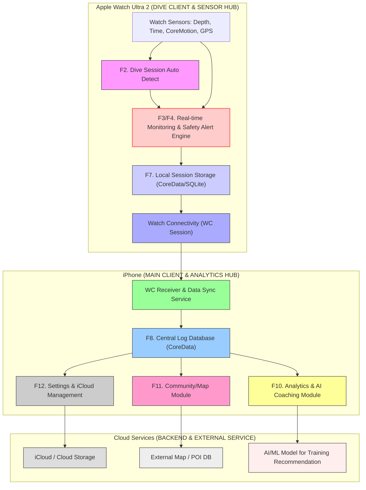

## 시스템 설계도



```mermaid

graph TD

    %% --- WATCH ULTRA 2 ---
    subgraph WU2["Watch Ultra 2 (DIVE CLIENT & SAFETY CORE)"]
        W1["Depth/Pressure Sensor Data"] --> W2["F2. Dive Session Auto Detector"]
        W2 --> W3["F3/F4. Real-time Log & Safety Alert Engine"]
        W3 --> W4["F7. Local Session Storage (Offline Cache)"]
        W3 --> W5["F4. Haptic Feedback / UI Alert"]
        W4 -- "WatchConnectivity (WC)" --> I1
    end

    %% --- iPhone ---
    subgraph IPHONE["iPhone (DATA HUB & ANALYTICS ENGINE)"]
        I1["WC Data Receiver"] --> I2["F8. Central Log Database (Source of Truth)"]
        I2 --> I3["F8. Log Visualization / PB Extractor"]
        I2 --> I4["F10. Analytics & AI Coaching Engine"]
        I2 --> I5["F11. Community / Map Module"]
        I2 -- "F12. Backup/Sync" --> B1
        I4 -- "Model Training/Update" --> B2
        I5 -- "Map/POI Fetch" --> B3
    end

    %% --- Backend / Cloud ---
    subgraph BACKEND["Backend Services (CLOUD / AI / EXTERNAL)"]
        B1["F12. iCloud / Cloud Storage (Backup & Settings Sync)"]
        B2["F10. AI/ML Model Training Platform"]
        B3["F11. External Map / POI Database"]
    end

    %% CLASS DEFINITIONS
    classDef watchModule fill:#f9f,stroke:#333;
    class W1,W2,W3,W4,W5 watchModule;

    classDef phoneModule fill:#9cf,stroke:#333;
    class I1,I2,I3,I4,I5 phoneModule;

    classDef backendModule fill:#ddd,stroke:#333;
    class B1,B2,B3 backendModule;

    %% SPECIAL STYLES
    style W3 fill:#fcc,stroke:#f66,stroke-width:2px;
    style I2 fill:#aaff99,stroke:#333;

