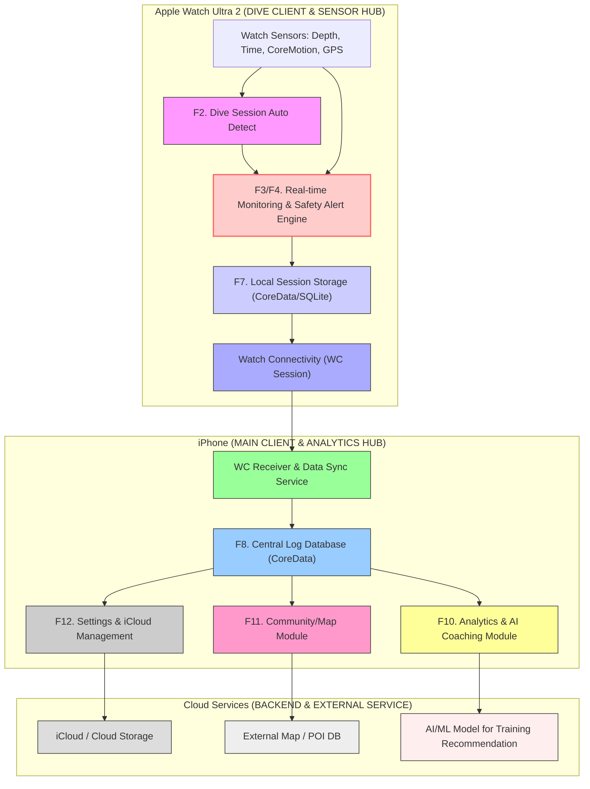
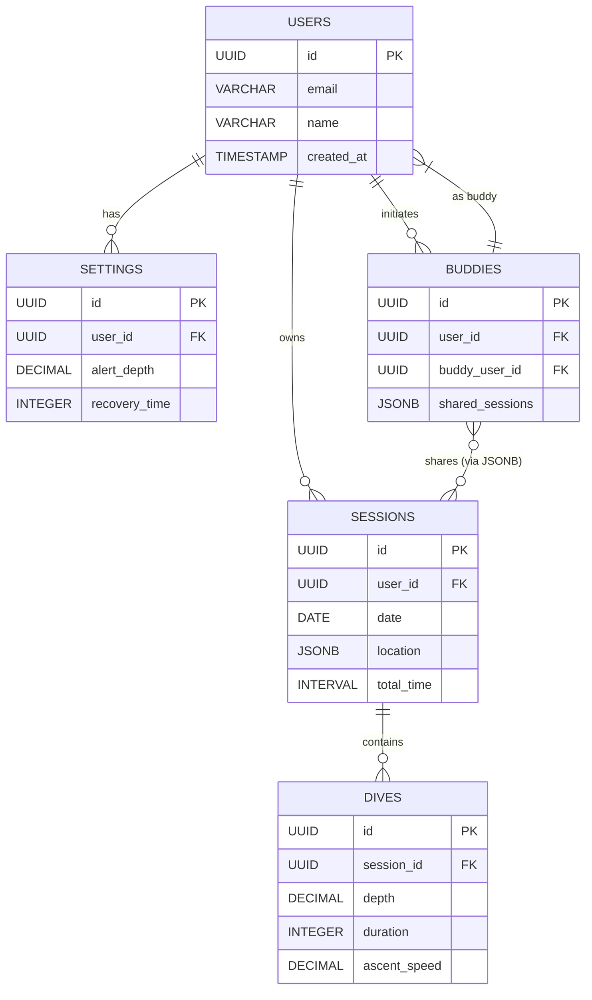

## 시스템 설계도

## DB 설계

#### 추가 고려사항
- **마이그레이션**: Alembic나 Flyway로 스키마 버전 관리.
- **보안**: RLS(Row-Level Security)로 사용자별 데이터 격리 (Apple 정책 준수).
- **성능 튜닝**: TimescaleDB 확장으로 시계열 로그 최적화 (분석 쿼리 <1s).
- **테스트**: 성공지표(로그 8회/주) 기반 부하 테스트.

이 설계는 PRD의 모든 데이터 요구를 커버하며, 프로토타입 시 Supabase로 무료 시작 추천. 더 세부(뷰/트리거) 필요 시 말씀해주세요!
### 1. User Table (사용자 정보)

| 필드명 | 데이터 타입 | 제약 조건 | 설명 |
|:---|:---|:---|:---|
| **user\_id** | UUID | Primary Key, Not Null | 사용자 고유 ID (Watch/iPhone 동기화 기준) |
| **email** | VARCHAR(255) | Unique | 로그인 및 계정 관리용 이메일 |
| **nickname** | VARCHAR(50) | Unique | 커뮤니티 기능(F11)용 닉네임 |
| **pb\_depth** | NUMERIC(5, 2) | Not Null | 개인 최고 수심 (미터) |
| **pb\_time** | INTEGER | Not Null | 개인 최고 잠수 시간 (초) |
| **alert\_settings** | JSONB | Not Null | F12. 워치 알림 설정 (깊이, 휴식 시간 등) |
| **created\_at** | TIMESTAMP | Not Null | 계정 생성일 |

### 2. DiveSession Table (다이빙 세션 정보)

하나의 세션(예: 오전 다이빙)에 여러 개의 개별 다이브 로그가 포함됩니다.

| 필드명 | 데이터 타입 | 제약 조건 | 설명 |
|:---|:---|:---|:---|
| **session\_id** | UUID | Primary Key, Not Null | 세션 고유 ID |
| **user\_id** | UUID | Foreign Key (User), Not Null | 세션을 기록한 사용자 ID |
| **start\_time** | TIMESTAMP | Not Null | 세션 시작 시간 (F2 기준) |
| **end\_time** | TIMESTAMP | Not Null | 세션 종료 시간 |
| **max\_depth** | NUMERIC(5, 2) | Not Null | 세션 내 최대 수심 (미터) |
| **total\_dives** | INTEGER | Not Null | 세션 내 총 다이브 횟수 |
| **location** | GEOMETRY(Point, 4326) | Nullable | F11. GPS 기반 다이브 스팟 위치 (PostGIS) |
| **watch\_synced**| BOOLEAN | Not Null | Watch $\to$ iPhone 동기화 여부 (신뢰성 지표) |

### 3. DiveLog Table (개별 다이브 로그)

하나의 세션에 속하는 개별 잠수 기록(Dive Count)입니다.

| 필드명 | 데이터 타입 | 제약 조건 | 설명 |
|:---|:---|:---|:---|
| **dive\_id** | UUID | Primary Key, Not Null | 다이브 고유 ID |
| **session\_id** | UUID | Foreign Key (Session), Not Null | 속한 세션 ID |
| **dive\_count** | INTEGER | Not Null | 세션 내 다이브 순서 (F2) |
| **dive\_time** | INTEGER | Not Null | 잠수 경과 시간 (초) |
| **max\_depth** | NUMERIC(5, 2) | Not Null | 최대 수심 (미터) |
| **surface\_interval** | INTEGER | Not Null | 직전 다이브 후 표면 회복 시간 (초, F6) |
| **avg\_ascent\_rate** | NUMERIC(4, 2) | Nullable | 평균 상승 속도 (m/s) |
| **raw\_data** | JSONB | Nullable | F7. 0.5초 간격으로 기록된 **수심-시간-수온** 배열 데이터 |
| **safety\_alerts** | JSONB | Nullable | F4. 경고 발생 시점/유형 기록 (예: `[{time: 60, type: "FastAscent"}]`) |

### 4. DiveSpot Table (다이빙 스팟 정보 - F11)

커뮤니티 기능 및 지도 표시를 위한 테이블입니다.

| 필드명 | 데이터 타입 | 제약 조건 | 설명 |
|:---|:---|:---|:---|
| **spot\_id** | UUID | Primary Key, Not Null | 스팟 고유 ID |
| **location** | GEOMETRY(Point, 4326) | Not Null | 스팟의 정확한 지리 좌표 |
| **spot\_name** | VARCHAR(255) | Not Null | 스팟 이름 |
| **avg\_rating** | NUMERIC(2, 1) | Not Null | 사용자 평균 별점 |
| **total\_reviews** | INTEGER | Not Null | 총 리뷰 수 |

---

## UI 설계

## ⌚️ Apple Watch Ultra 2 UI 시안

요청하신 **FreeDivingLog** 앱의 Apple Watch Ultra 2용 핵심 화면 UI 목업입니다.

---

### 1. 홈/준비 화면 (Home/Pre-Dive Screen)

프리다이버의 PB와 현재 세션 통계를 보여주는 시작 화면입니다.

http://googleusercontent.com/image_generation_content/0

---

### 2. 다이빙 실시간 모니터링 화면 (Real-time Dive Monitor)

다이빙 중 실시간 수심, 시간, 안전 경고를 표시하는 화면입니다.

http://googleusercontent.com/image_generation_content/1

---

### 3. 표면 회복 타이머 화면 (Surface Interval Timer)

수면 복귀 후 회복 시간 관리 및 직전 다이브 기록을 보여주는 화면입니다.

http://googleusercontent.com/image_generation_content/2

