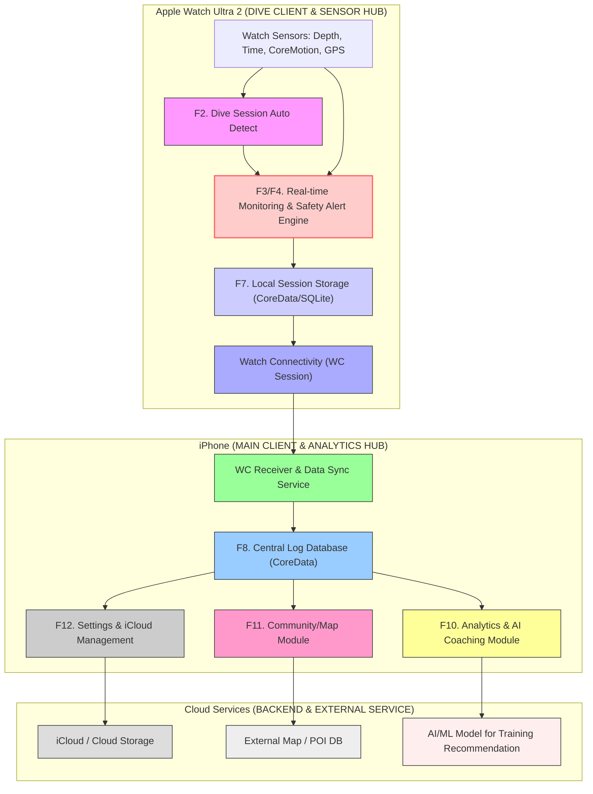
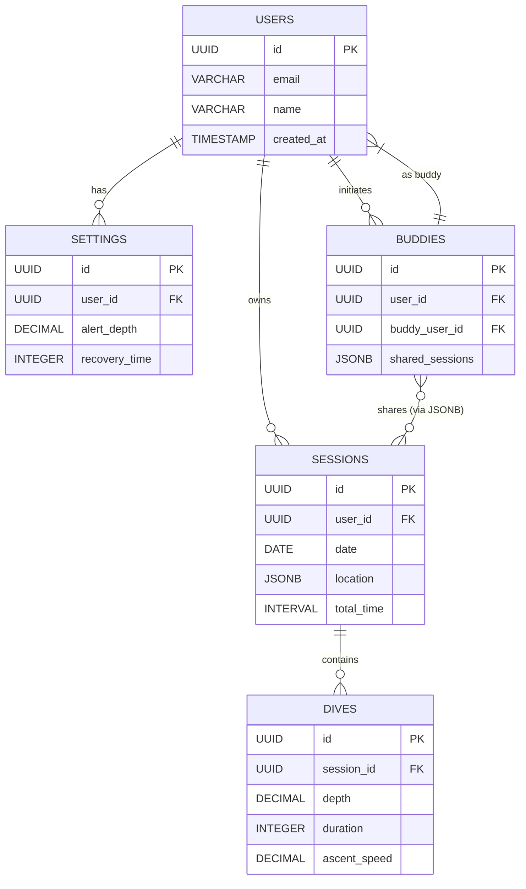

## 시스템 설계도

## DB 설계

---

## UI 설계

## ⌚️ Apple Watch Ultra 2 UI 시안

요청하신 **FreeDivingLog** 앱의 Apple Watch Ultra 2용 핵심 화면 UI 목업입니다.

---

### 1. 홈/준비 화면 (Home/Pre-Dive Screen)

프리다이버의 PB와 현재 세션 통계를 보여주는 시작 화면입니다.

---

### 2. 다이빙 실시간 모니터링 화면 (Real-time Dive Monitor)

다이빙 중 실시간 수심, 시간, 안전 경고를 표시하는 화면입니다.

---

### 3. 표면 회복 타이머 화면 (Surface Interval Timer)

수면 복귀 후 회복 시간 관리 및 직전 다이브 기록을 보여주는 화면입니다.

