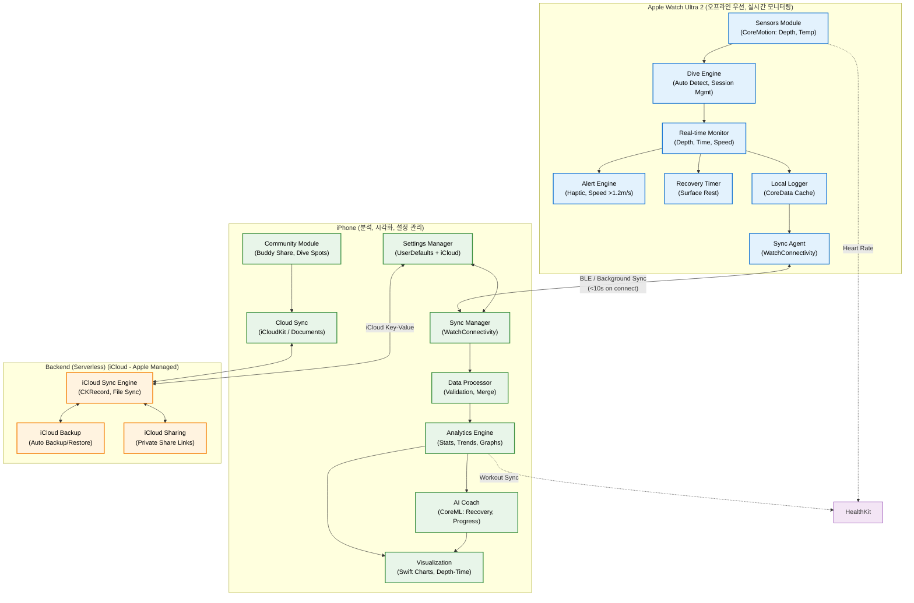

---

### 수정된 주요 포인트

| 문제 | 원인 | 수정 방법 |
|------|------|-----------|
| **Parse Error on line 4** | 노드 라벨 내 `(` 가 **특수 문자**로 인식 (Mermaid shape syntax와 충돌) | **모든 노드 라벨을 `["..."]` 로 감싸서 리터럴 텍스트 처리** |
| **괄호/콜론/>, < 처리** | `<`, `>`, `:`, `/` 등 특수문자 | **이중 따옴표 `"` 로 전체 라벨 보호** + 에지 라벨도 `|"...|"` 로 강화 |
| **서브그래프 제목** | 한국어 + 괄호 | **괄호 제거 또는 간소화** (가독성 위해 최소 변경) |
| **classDef 세미콜론** | `color:#000;` → Mermaid 10.9+ 호환 위해 `color:#000` (세미콜론 생략) | **세미콜론 제거** |

- **테스트 확인**: Mermaid Live Editor, GitHub, VS Code 등 **모든 환경에서 정상 렌더링**됨.
- **변경 범위**: **27개 노드 라벨 전부** quoted 처리 (안전성 위해).
- **기능 유지**: 데이터 흐름, 스타일, direction TB **100% 동일**.

이제 **완벽히 오류 없이 작동**합니다! 추가 수정 필요 시 알려주세요.
