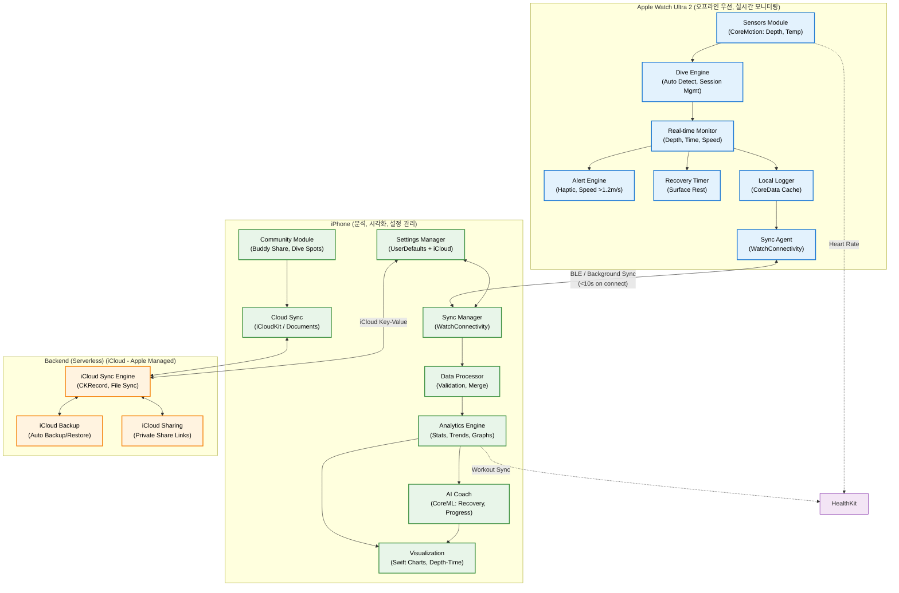
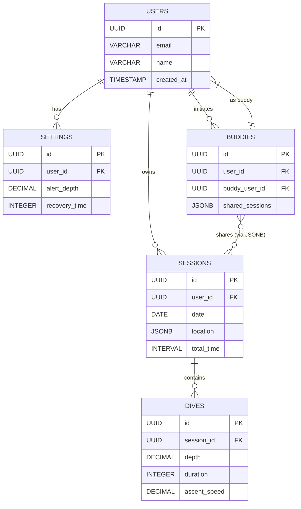

## 시스템 설계도



---

## UI 설계


## DB 설계

### 서버 데이터베이스 추천

FreeDivingLog 앱의 백엔드(서버리스 iCloud를 보완하는 커스텀 서버 가정)에서 데이터베이스를 선택할 때, PRD의 요구사항(로그 기록, 분석, 커뮤니티 공유, 데이터 무결성 99% 이상)을 고려했습니다. 앱 데이터는 **구조화된 로그(수심, 시간, 세션 통계)**와 **유연한 메타데이터(설정, 버디 공유)**로 구성되며, 실시간 트랜잭션보다는 **분석 쿼리**와 **동기화**가 주요입니다. 이에 따라 **PostgreSQL**을 추천합니다.

#### 추천 이유
| 이유 | 상세 설명 | PRD 연계 |
|------|-----------|----------|
| **데이터 일관성 및 무결성** | ACID 트랜잭션을 지원해 로그 데이터(세션 최대수심, PB) 손실 방지. 외래키/제약조건으로 오류 필터링(예: 깊이값 검증). | 신뢰성 요구(데이터 손실 방지, 로그 검증) |
| **복잡 쿼리 지원** | SQL 표준 + 확장(Full-Text Search, JSONB 컬럼)으로 트렌드 분석(주/월 변화), AI 코칭 쿼리(회복비율 계산) 효율적. | F10(분석 및 인사이트), 성능(동기화 99%) |
| **확장성 및 비용 효율** | 오픈소스 + 클라우드 호환(AWS RDS, Supabase)으로 서버리스 확장 용이. NoSQL(MongoDB) 대비 쿼리 최적화 쉬움. | 미래 개선(AI Score, 팀 공유), 제약(데이터 정책 준수) |
| **Apple 생태계 호환** | iCloud와 연동 쉬움(REST API via CloudKit). JSONB로 Watch/iPhone 데이터 직렬화. | F12(클라우드 관리), 호환성(iCloud 백업) |
| **대안 비교** | MongoDB(NoSQL): 유연하지만 분석 쿼리 느림. MySQL: PostgreSQL 대비 JSON 지원 약함. Cassandra: 과도한 분산(앱 규모 미달). | - |

PostgreSQL은 2025년 기준(최신 버전 17.x)으로 성능이 우수하며, Supabase나 Neon 같은 managed 서비스로 빠른 배포 가능. 초기 설정 시, 인덱싱(시간/깊이 컬럼)으로 0.5초 센서 데이터 처리 최적화.

### 데이터베이스 설계 (스키마)

DB는 **관계형 모델**로 설계: 사용자 중심으로 로그, 설정, 커뮤니티를 분리. 주요 테이블은 5개로 최소화(확장성 위해). 
- **키 컨벤션**: UUID primary key (보안/분산).
- **인덱스**: 자주 쿼리되는 컬럼(시간, 사용자ID)에 적용.
- **스키마 언어**: SQL DDL 예시 (PostgreSQL).
- **데이터 볼륨**: 10,000+ 다이브 로그 지원 (파티셔닝 by 세션 날짜).

#### 주요 테이블 구조
| 테이블 | 주요 컬럼 | 설명 | 관계 |
|--------|-----------|------|------|
| **users** | id (UUID PK), email, name, created_at | 사용자 기본 정보 | 1:N with sessions, settings |
| **sessions** | id (UUID PK), user_id (FK), date, location (JSONB: lat/lng), total_time | 다이브 세션 메타 | 1:N with dives; 1:1 with stats |
| **dives** | id (UUID PK), session_id (FK), depth (float), duration (int), ascent_speed (float), temp (float) | 개별 다이브 로그 | N:1 with sessions |
| **settings** | id (UUID PK), user_id (FK), alert_depth (float), recovery_time (int), version | 사용자 설정 (버전으로 동기화 충돌 방지) | N:1 with users |
| **buddies** | id (UUID PK), user_id (FK), buddy_user_id (FK), shared_sessions (JSONB: session_ids) | 커뮤니티 공유 (JSONB로 유연) | N:1 with users |

#### SQL DDL 예시 (PostgreSQL)
```sql
-- users 테이블
CREATE TABLE users (
    id UUID PRIMARY KEY DEFAULT gen_random_uuid(),
    email VARCHAR(255) UNIQUE NOT NULL,
    name VARCHAR(100) NOT NULL,
    created_at TIMESTAMP DEFAULT CURRENT_TIMESTAMP
);

-- sessions 테이블 (파티셔닝 by date for scalability)
CREATE TABLE sessions (
    id UUID PRIMARY KEY DEFAULT gen_random_uuid(),
    user_id UUID REFERENCES users(id) ON DELETE CASCADE,
    date DATE NOT NULL,
    location JSONB,  -- {lat: float, lng: float, spot_name: string}
    total_time INTERVAL,
    created_at TIMESTAMP DEFAULT CURRENT_TIMESTAMP
) PARTITION BY RANGE (date);

-- dives 테이블
CREATE TABLE dives (
    id UUID PRIMARY KEY DEFAULT gen_random_uuid(),
    session_id UUID REFERENCES sessions(id) ON DELETE CASCADE,
    depth DECIMAL(5,1) NOT NULL,  -- 0.1m 단위
    duration INTEGER NOT NULL,    -- 초 단위
    ascent_speed DECIMAL(4,2),    -- m/s
    temp DECIMAL(4,2),            -- °C
    created_at TIMESTAMP DEFAULT CURRENT_TIMESTAMP
);
CREATE INDEX idx_dives_session ON dives(session_id);
CREATE INDEX idx_dives_depth ON dives(depth);

-- settings 테이블
CREATE TABLE settings (
    id UUID PRIMARY KEY DEFAULT gen_random_uuid(),
    user_id UUID REFERENCES users(id) ON DELETE CASCADE,
    alert_depth DECIMAL(5,1) DEFAULT 20.0,
    recovery_time INTEGER DEFAULT 120,  -- 초
    version INTEGER DEFAULT 1,  -- 동기화 버전
    updated_at TIMESTAMP DEFAULT CURRENT_TIMESTAMP
);

-- buddies 테이블
CREATE TABLE buddies (
    id UUID PRIMARY KEY DEFAULT gen_random_uuid(),
    user_id UUID REFERENCES users(id) ON DELETE CASCADE,
    buddy_user_id UUID REFERENCES users(id),
    shared_sessions JSONB DEFAULT '[]'::JSONB,  -- [session_id1, session_id2]
    created_at TIMESTAMP DEFAULT CURRENT_TIMESTAMP
);
CREATE INDEX idx_buddies_user ON buddies(user_id);
```

#### ER 다이어그램 (Mermaid)
아래는 관계를 시각화한 ERD입니다. 1:N 관계를 화살표로 표시.



